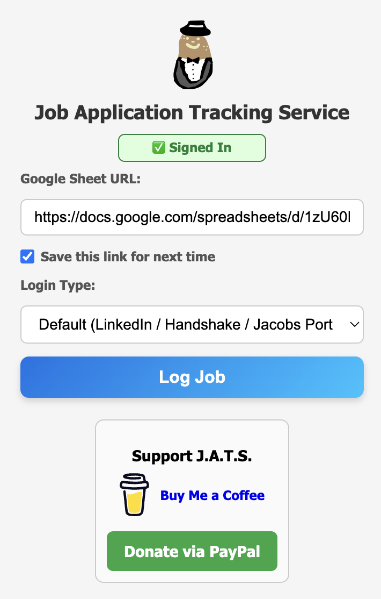

<p align="center">
  
</p>


# JATS (Job Application Tracking Software)

**Chrome Extension to log job applications from LinkedIn, Handshake, and UCSD Jacobs Portal into Google Sheets.**

---

## Features

- Automatically extract job information:  
  - Job title  
  - Company name  
  - Job link  
  - Date applied  
  - Login type (LinkedIn, Handshake, Jacobs Portal)  

- Save and reuse your Google Sheet URL for convenience.  
- Provides a **template Google Sheet** to make setup easy.  
- Donation buttons integrated (Buy Me a Coffee, PayPal) without cluttering the UI.  
- Responsive, clean popup UI with intuitive inputs and dropdowns.

---

## Installation

1. Download or clone this repository:

    ``` 
    git clone https://github.com/<your-username>/JATS.git
    ```

2. Open **Chrome** → `chrome://extensions/`  
3. Enable **Developer mode** (top right)  
4. Click **Load unpacked** → select the `JATS` folder  

---

## Usage

1. Open the popup by clicking the JATS extension icon.  
2. Enter your **Google Sheet URL** (copy of the provided template).  
3. Select the login type and click **Log Job**.  
4. Your job application info will be automatically added to your sheet.  

---

## Privacy

- All job data is stored in the user’s **own Google Sheet**.  
- A **template** is provided for convenience; no data is sent to external servers.  
- Full privacy policy: [Privacy Policy](https://mokeycodes.github.io/JATS-Privacy-Policy/)

---

## Screenshots

  

---

## License

This project is licensed under the **MIT License**. See [LICENSE](LICENSE) for details.
