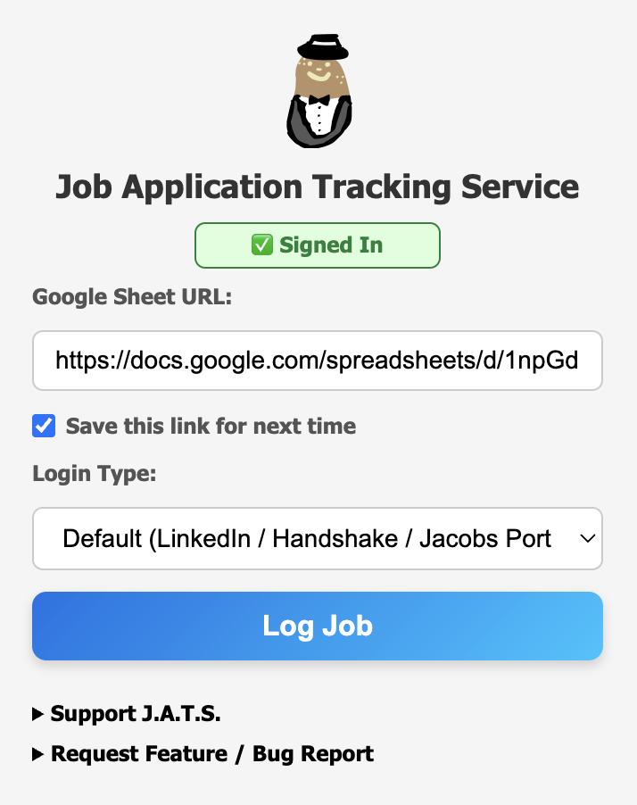

<p align="center">
  
</p>


# J.A.T.S. (Job Application Tracking Service) — v1.1.1

**A Chrome extension that logs job applications from LinkedIn, Handshake, and the UCSD Jacobs Portal directly into Google Sheets.**  
*May work on other sites, but functionality will be limited.*

**Homepage:** [https://mokeycodes.github.io/JATS/](https://mokeycodes.github.io/JATS/)

## Features

- Automatically extract job information:  
  - Job title  
  - Company name  
  - Job link  
  - Date applied  
  - Login type (LinkedIn, Handshake, Jacobs Portal)  

- Save and reuse your Google Sheet URL for convenience.  
- **Auto Generates** a **template Google Sheet** to make setup easy.  
- Donation buttons integrated (Buy Me a Coffee, PayPal) without cluttering the UI.
- Responsive, clean popup UI with intuitive inputs and dropdowns.

---

## Installation

You can install J.A.T.S. directly from the Chrome Web Store:

➡️ **[Chrome Web Store Link](https://chromewebstore.google.com/detail/papieahfnaoehbgnlaihbcipfgfboobk?utm_source=item-share-cb)**  

---

### Request New Website Support
Want J.A.T.S. to work on another job site?  
Have a feature request or noticed a bug?  

Submit a **[Google Form Request](https://docs.google.com/forms/d/e/1FAIpQLSeR4HpD_-Bg5dmjOml70jW9sVLHK2BCerNlQK-RXs1wrUjySw/viewform?usp=dialog)**.  

Popular requests will be prioritized in future updates.


---

## Local Development (Unpacked Mode)

You can load **J.A.T.S.** locally for development by running it as an unpacked extension.  
**Important:** Google OAuth (used for Google sign-in and Sheets logging) will **not work** automatically in unpacked mode.

### Why OAuth Fails in Unpacked Mode
The published extension uses a Google OAuth Client ID that is tied to the **official Chrome Web Store extension ID**.

When loaded as an unpacked extension, Chrome generates a **different temporary extension ID**, causing Google OAuth to reject the request.  
This is expected behavior for any Chrome extension using Google OAuth.

---

## How to Run Locally (UI Only)

1. Clone the repository:

   ```bash
   git clone https://github.com/MokeyCodes/JATS.git
   ```

2. Open Chrome and visit:

   ```
   chrome://extensions/
   ```

3. Enable **Developer mode**  
4. Click **Load unpacked**  
5. Select the `JATS` folder

This loads the UI, but Google sign-in + Google Sheets logging will not function without your own OAuth credentials.

---

## Enabling Google OAuth Locally (Optional)

If you want Google Sheets logging to work in unpacked mode:

1. Open **Google Cloud Console** → APIs & Services → **Credentials**
2. Create an **OAuth 2.0 Client ID** (Application type: *Chrome Extension*)
3. Find your Local JATS **ID** from **Details** in `chrome://extensions/`
4. Add that ID as the Item ID in the OAuth Client ID creation
5. Replace the `CLIENT_ID` in the code with the new client ID

After this, Google sign-in and Sheets logging will work locally.

---

## Summary

- The UI can be tested locally  
- Google OAuth (Logging Jobs) will **not work** unless you create your own OAuth Client ID  
- The published Chrome Web Store version is not affected

---


## Usage

1. Open the popup by clicking the JATS extension icon.  
2. Enter your **Google Sheet URL** (copy of the provided template).  
3. Select the login type and click **Log Job**.  
4. Your job application info will be automatically added to your sheet.  

---

## Privacy

- All job data is stored in the user’s **own Google Sheet**.  
- A **template** is provided for convenience; no data is sent to external servers.  
- Full privacy policy: [Privacy Policy](https://mokeycodes.github.io/JATS-Privacy-Policy/)

---

## Screenshots

| v1.0.1 | v1.1.0 |
|--------|--------|
|  |  |

### Template Creation Update

In **v1.1.0**, JATS automatically creates a Google Sheet template the first time you log a job.  

- The **“Copy Template”** button from v1.0.1 is no longer needed and has been removed.  
- Users only need to **sign in and log a job**, and JATS will automatically generate a pre-formatted sheet with:
  - Navy blue headers with bold white text
  - Dual-row column titles (title + description)
  - Colored login cells
  - Dropdown options for job status with data validation
  - Frozen header row for easy navigation
- Any previously saved Google Sheet link is automatically used if available.

This streamlines setup and ensures users always have a properly formatted sheet without manual copying.

---
For full version history, see [CHANGELOG.md](CHANGELOG.md)
---

## License

This project is licensed under the **MIT License**. See [LICENSE](LICENSE) for details.

**Project Homepage:** [https://mokeycodes.github.io/JATS/](https://mokeycodes.github.io/JATS/)